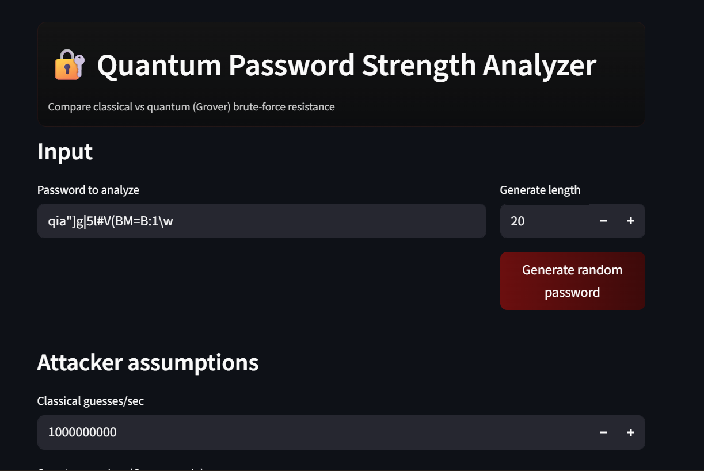
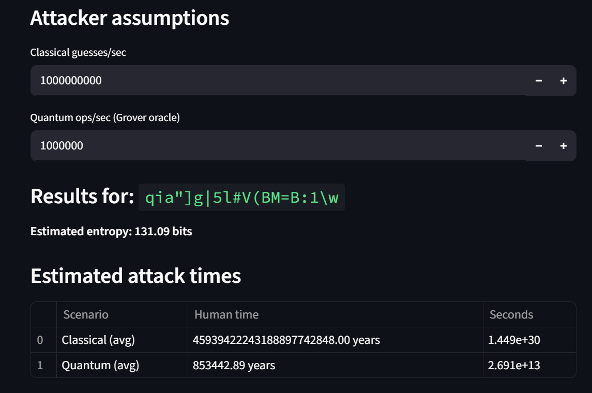
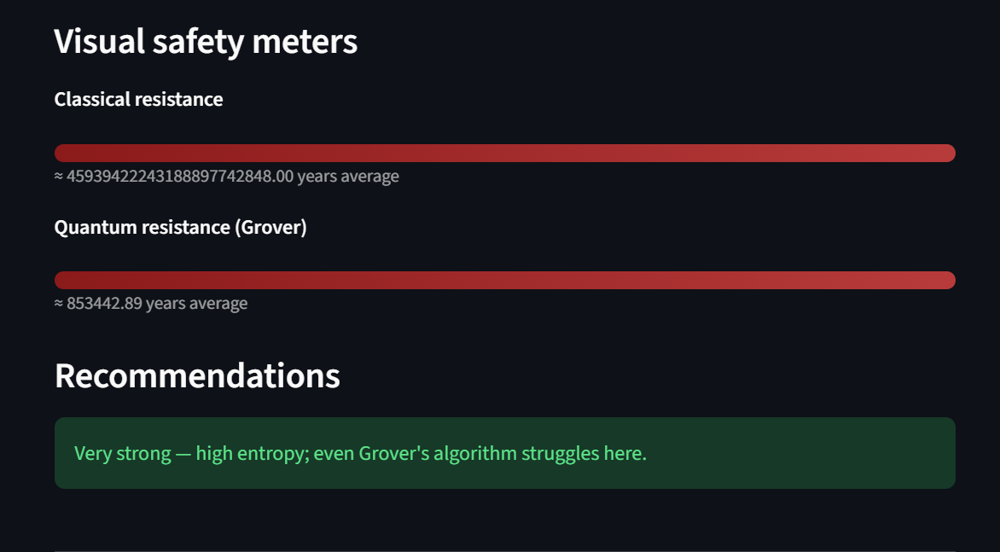
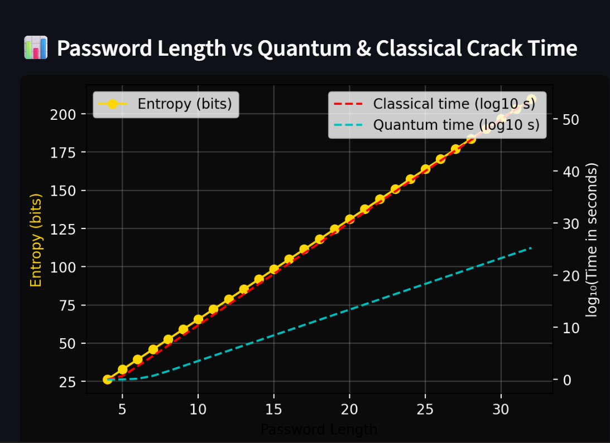

# Quantum Password Strength Analyzer

A **Streamlit-based simulator** that evaluates password security against **classical** and **quantum (Grover’s algorithm)** brute-force attacks.  
This educational tool helps visualize the difference in password resistance under traditional and quantum computing assumptions.

---

## Features

- Accepts **user-provided passwords** or generates random strong passwords.
- Estimates **entropy** (in bits) based on character diversity.
- Computes **classical brute-force time** (full & average) using configurable attacker speed.
- Computes **quantum brute-force time** using Grover’s algorithm (full & average).
- Displays **human-readable times** (seconds → years).
- Visualizes results with **interactive meters and graphs**.
- Provides **remediation advice** for stronger passwords safe against quantum attacks.
- Pure simulation — **no quantum libraries required**.

---

## Demo

  <!-- Add a screenshot of your app here -->



---

## Installation

1. Clone the repository:
```bash
git clone https://github.com/Carolrebecca/QuantumPasswordStrengthAnalyzer.git
cd QuantumPasswordStrengthAnalyzer
````

2. Install dependencies:

```bash
pip install -r requirements.txt
```

3. Run the app:

```bash
streamlit run main.py
```

---

## Usage

1. Enter your password or generate a new one.
2. The app will calculate:

   * Entropy (bits)
   * Classical brute-force times
   * Quantum brute-force times (Grover’s algorithm)
3. View interactive meters and graphs to see security strength.
4. Adjust attacker assumptions (operations per second) to simulate different scenarios.

---

## Dependencies

* `streamlit`
* `matplotlib`
* `numpy`

*(Install using `pip install -r requirements.txt`)*

---

## Educational Purpose

This project is a **simulation** for learning and demonstration. It **does not perform real quantum computation**, but illustrates the concept of quantum attacks on passwords and helps raise awareness of post-quantum cybersecurity considerations.

---

## License

MIT License © 2025 Carol Rebecca

```


